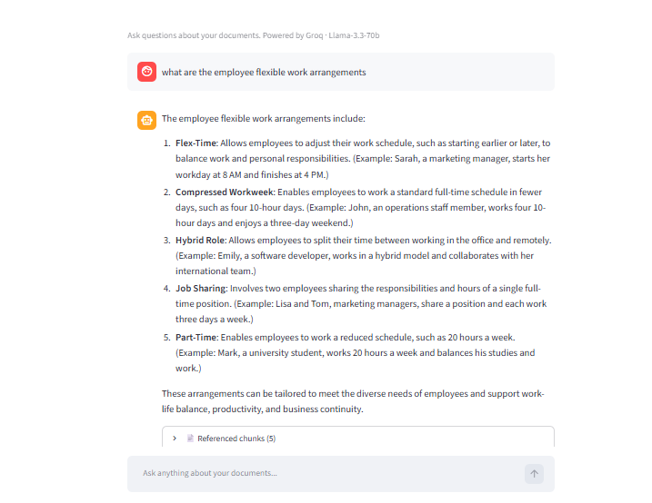

<div align="center">

# 🤖 HR Policy RAG Chatbot

### *Ask your HR documents anything. Get instant, accurate, cited answers.*


</div>

---

## 📖 Brief Description

The **HR Policy RAG Chatbot** is an AI-powered question-answering system that lets employees instantly query any HR policy document — leave policies, benefits, onboarding guides, compliance frameworks, and more — through a conversational chat interface.

Built on **Retrieval-Augmented Generation (RAG)**, the chatbot does not guess or hallucinate. Every answer is grounded in your actual documents, with **clickable source links** and the **exact text chunk** the AI used to generate its response shown transparently below each answer.

> No more digging through PDFs. No more waiting for an HR email reply.  
> Ask in plain English. Get a precise, cited answer in seconds.

---

## ❗ Problem Statement

In most organisations, HR knowledge is locked inside static PDF files — policy handbooks, benefits guides, compliance documents — that employees rarely read and HR teams repeatedly explain.

**The pain points:**

| Problem | Impact |
|---|---|
| Employees can't find policy answers quickly | Lost productivity, frustration |
| HR teams answer the same questions repeatedly | High workload, slow response |
| Documents are long, dense, hard to navigate | Low policy awareness |
| No audit trail of what information was given | Compliance risk |

**What this chatbot solves:**

- ✅ Employees get **instant, self-service answers** from official documents
- ✅ Every answer shows **exactly which document and chunk** it came from
- ✅ HR teams are freed from repetitive Q&A work
- ✅ **Conversational memory** allows natural follow-up questions
- ✅ Full chat can be **exported as a Word document** for record-keeping

---

## 🧠 Architecture Overview

```
┌─────────────────────────────────────────────────────────────────────────┐
│                        HR POLICY RAG CHATBOT                            │
│                                                                         │
│  ┌──────────┐    ┌──────────────┐    ┌──────────────────────────────┐  │
│  │  data/   │───▶│  chunking.py │───▶│        rag_graph.py          │  │
│  │          │    │              │    │                              │  │
│  │ .txt     │    │ SemanticChunker    │  FAISS  │  BM25  │  Groq   │  │
│  │ .pdf     │    │ (parent chunks)│   │  Index  │ Rerank │  LLM    │  │
│  │ .docx    │    │ RecursiveSplit │   └──────────────────────────────┘  │
│  └──────────┘    │ (child chunks)│                  │                  │
│                  └──────────────┘                   ▼                  │
│                                           ┌──────────────────┐         │
│                                           │  streamlit_app.py│         │
│                                           │  Chat UI + Source│         │
│                                           │  Viewer + Export │         │
│                                           └──────────────────┘         │
└─────────────────────────────────────────────────────────────────────────┘
```

---

## 🔄 System Workflow

```
📄 Documents (PDF / TXT / DOCX)
        │
        ▼  [Step B]
🧩 Semantic Chunking
   SemanticChunker finds natural topic boundaries using embeddings
   → Large PARENT chunks (topic-coherent sections)
        │
        ▼  [Step B cont.]
✂️  Hierarchical Splitting
   Each parent is sliced into small CHILD chunks (800 chars)
   → Children linked back to parents via parent_id
        │
        ▼  [Step C]
🔢 Embedding Generation
   all-MiniLM-L6-v2 converts each child chunk → 384-dim vector
        │
        ▼  [Step D]
🗃️  FAISS Vector Index
   All child embeddings stored in a local FAISS index (saved to disk)
        │
        ▼  [Step E]  ← User sends a question
🎯 Dense Retrieval
   Question embedded → cosine similarity → top-10 child chunks
        │
        ▼  [query-adaptive swap]
🔀 Parent / Child Selection
   Broad query  → swap children for full parent chunks (more context)
   Precise query → keep child chunks (targeted snippets)
        │
        ▼  [Step F]
📊 BM25 Reranking
   Keyword scoring re-orders candidates → top-5 most relevant chunks
        │
        ▼  [Step G]
🤖 LLM Response Generation
   Groq Llama-3.3-70b receives context + question → generates answer
        │
        ▼  [Step H]
💬 Conversational Memory
   Last 6 messages included in prompt → supports follow-up questions
        │
        ▼  [Step I]
📋 Output
   Answer displayed in chat │ Source chunks shown │ Export to DOCX
```

---

## ⚙️ Step-by-Step Pipeline Breakdown

### Step A — Document Ingestion
The system scans the `data/` folder recursively and loads every supported file using the appropriate LangChain loader:

| Format | Loader | Notes |
|---|---|---|
| `.txt` | `TextLoader` | Plain text, fastest to load |
| `.pdf` | `PyPDFLoader` | Extracts text page-by-page, preserves page numbers |
| `.docx` | `Docx2txtLoader` | Extracts text from Word documents |

---

### Step B — Two-Level Hierarchical + Semantic Chunking

This is the most important step. A naive fixed-size splitter cuts sentences mid-thought, destroying context. This system uses **two levels** of splitting:

**Level 1 — Semantic Parent Chunks**
```
SemanticChunker(
    breakpoint_threshold_type = "percentile",
    breakpoint_threshold_amount = 85
)
```
The chunker embeds every sentence and measures cosine similarity between adjacent sentences. When two consecutive sentences fall below the 85th percentile similarity, a chunk boundary is inserted. This ensures each parent chunk covers **one complete topic**.

**Level 2 — Hierarchical Child Chunks**
```
RecursiveCharacterTextSplitter(chunk_size=800, chunk_overlap=100)
```
Each semantic parent is further sliced into smaller children. Children are what gets **embedded and stored in FAISS**. Each child carries a `parent_id` so the retriever can look up the full parent when needed.

**Why two levels?**

```
CHILD chunks → precise embedding match (small, focused)
PARENT chunks → rich context for the LLM (large, topic-complete)
```

---

### Step C — Embedding Generation

Each child chunk is converted to a 384-dimensional numerical vector using:

```
Model: sentence-transformers/all-MiniLM-L6-v2
```

- Runs **entirely on CPU** — no GPU required
- Downloaded once (~80 MB) and cached locally
- No API key or internet connection needed after first download
- Trained specifically for semantic similarity tasks

---

### Step D — FAISS Vector Store

All child chunk embeddings are stored in a **local FAISS index** (Facebook AI Similarity Search).

| Feature | Detail |
|---|---|
| Index type | Flat L2 (exact search) |
| Storage | Saved to `index/faiss_child/` on disk |
| Parent store | `index/parents.pkl` — dict mapping `parent_id → Document` |
| Rebuild | Automatic on first run, manual via "Rebuild Index" button |

FAISS was chosen over cloud databases (Pinecone, Qdrant) for simplicity — **zero cloud accounts or API keys needed** for the vector store.

---

### Step E — Query-Adaptive Dense Retrieval

When the user asks a question, it is embedded and compared against all child chunk vectors using cosine similarity. The top-10 most similar chunks are returned.

Then, **query classification** determines what to do with them:

```python
"broad"   → How / Why / Explain / List / Describe / long questions (>8 words)
             → swap child chunks for their full parent chunks
             → gives the LLM more surrounding context

"precise" → What is / Who / When / short factual questions
             → keep child chunks
             → gives the LLM a targeted, specific snippet
```

---

### Step F — BM25 Reranking

The top candidates from FAISS are reranked using **BM25 (Best Match 25)** — a classic keyword-scoring algorithm.

**Why rerank after semantic search?**

- FAISS finds *semantically* similar chunks (great for paraphrasing)
- BM25 ensures the chunks also contain the *exact keywords* from the question
- Combining both catches cases where semantic similarity alone returns tangentially related content

The final **top-5 chunks** after reranking are sent to the LLM.

---

### Step G — LLM Response Generation

The top-5 chunks are formatted into a prompt and sent to **Groq's Llama-3.3-70b-versatile** via the Groq API.

```
Model    : llama-3.3-70b-versatile
Provider : Groq (free tier available)
Speed    : ~500 tokens/second (Groq uses custom LPU hardware)
Temp     : 0 (deterministic, no randomness)
```

The prompt instructs the LLM to:
- Answer directly and specifically (not just describe the document)
- Use bullet points for lists
- Say "I don't have that information" if the answer isn't in the context
- Never make up information not present in the retrieved chunks

---

### Step H — Conversational Memory

The last **6 messages** (3 user + 3 assistant turns) are formatted into a `Chat History:` block and prepended to each new prompt. This allows natural follow-up questions:

```
User      : What is the flexible work policy?
Assistant : Employees may request...

User      : How do I apply for it?       ← follow-up understood in context
Assistant : To apply, you must...
```

---

### Step I — Output & Export

Every answer includes:
- 💬 The LLM-generated answer (with markdown formatting)
- 📄 An expandable **"Referenced chunks"** section (see feature below)
- 🏷️ A caption showing query type (`broad` / `precise`) + retrieval method used
- 📥 A **Download Chat (.docx)** button in the sidebar

---

## ✨ Features

| Feature | Description |
|---|---|
| 🧩 **Semantic + Hierarchical Chunking** | Two-level splitting preserves topic context while enabling precise retrieval |
| 🔀 **Query-Adaptive Retrieval** | Automatically switches between parent (broad) and child (precise) chunks |
| 📊 **BM25 Reranking** | Keyword scoring on top of semantic search for better accuracy |
| 💬 **Conversational Memory** | Remembers last 6 messages for natural follow-up questions |
| 📄 **Clickable Source Links** | Each answer shows which file it came from with a link to open it |
| 🔍 **Exact Chunk Viewer** | See the precise text the LLM used to generate each answer |
| 📥 **DOCX Export** | Download the full conversation as a formatted Word document |
| 🔄 **One-click Index Rebuild** | Add new documents and rebuild the index from the sidebar |
| 📁 **Multi-format Support** | Works with `.txt`, `.pdf`, and `.docx` files |
| 🚀 **Fast Inference** | Groq's LPU hardware delivers ~500 tokens/sec response speed |
| 🆓 **Fully Free** | Groq free tier + local FAISS + local embeddings = $0 to run |

---

## 🖥️ Streamlit App

The chat interface is built with **Streamlit** and provides a clean, intuitive experience.

### Layout

```
┌─────────────────┬────────────────────────────────────────────┐
│   SIDEBAR       │   MAIN CHAT AREA                           │
│                 │                                            │
│ 📁 Documents    │  🤖 RAG Chatbot                            │
│  • policy.pdf   │  Ask questions about your documents        │
│  • benefits.txt │                                            │
│                 │  ┌──────────────────────────────────────┐  │
│ [🔄 Rebuild]    │  │ 👤 What is the leave policy?         │  │
│                 │  └──────────────────────────────────────┘  │
│ [📄 Export]     │                                            │
│                 │  ┌──────────────────────────────────────┐  │
│ [🗑️ Clear]      │  │ 🤖 Employees are entitled to:        │  │
│                 │  │  • 20 days annual leave               │  │
│ Pipeline Info   │  │  • 10 days sick leave                 │  │
│ • Chunking      │  │  • 5 days emergency leave             │  │
│ • Embeddings    │  │                                        │  │
│ • FAISS k=10    │  │  📄 Referenced chunks (3)  ▼          │  │
│ • BM25 top 5    │  │  ┌──────────────────────────────────┐ │  │
│ • Groq LLM      │  │  │ Chunk 1 — [policy.pdf](link) p.4 │ │  │
│ • Memory        │  │  │ ▌ Employees are entitled to 20... │ │  │
│                 │  │  └──────────────────────────────────┘ │  │
│                 │  │                                        │  │
│                 │  │  Query: broad | parent chunks + BM25  │  │
│                 │  └──────────────────────────────────────┘  │
│                 │                                            │
│                 │  ┌──────────────────────────────────────┐  │
│                 │  │ Ask anything about your documents... │  │
│                 │  └──────────────────────────────────────┘  │
└─────────────────┴────────────────────────────────────────────┘
```

### Screenshot



> *The chatbot correctly classifies query type, retrieves relevant chunks, reranks them, and cites the exact source document with a clickable link.*

### Key UI Elements

- **Document list** — shows all indexed files in the sidebar
- **Rebuild Index** — re-processes all files in `data/` (use after adding new documents)
- **Export Chat** — downloads the full conversation as a `.docx` Word file
- **Clear Chat** — resets the conversation history
- **Referenced chunks** — expandable section below every answer (see below)
- **Query type caption** — tells you whether broad or precise retrieval was used

---

## 🔍 Referenced Chunks Feature

This is one of the most powerful features of the chatbot — **full transparency into what the AI actually read**.

Every assistant response includes an expandable **"📄 Referenced chunks (N)"** section:

```
📄 Referenced chunks (3)

Chunk 1 — [Flexible_Work_Toolkit_2025-01.pdf](file:///C:/.../data/...)  •  page 2
┃ Employees may request flexible work arrangements including remote work,
┃ compressed workweeks, and adjusted start/end times. Requests must be
┃ submitted at least two weeks in advance via the HR portal...

──────────────────────────────────────────────────────────
Chunk 2 — [HR_Policy_Handbook.pdf](file:///C:/.../data/...)  •  page 7
┃ Eligibility: Employees who have completed 6 months of continuous
┃ employment and received a satisfactory performance rating are eligible
┃ to apply for flexible work arrangements...

──────────────────────────────────────────────────────────
Chunk 3 — [Flexible_Work_Toolkit_2025-01.pdf](file:///C:/.../data/...)  •  page 3
┃ Managers must respond to flexible work requests within 5 business days.
┃ Approved arrangements are reviewed every 6 months...
```

**What each chunk shows:**
- 📎 **Clickable filename** — opens the source file directly on your machine
- 📑 **Page number** — exact page in the PDF where the text was found
- 📝 **Exact text** — the precise passage the LLM read to generate the answer

This means you can always **verify the AI's answer** against the original document.

---

## 📂 Folder Structure

```
rag-chatbot/
│
├── data/                        ← Put your documents here
│   └── (your .pdf / .txt / .docx files)
│
├── index/                       ← Auto-generated, do not edit
│   ├── faiss_child/             ← FAISS vector index (child chunks)
│   └── parents.pkl              ← Parent chunk lookup dictionary
│
├── venv/                        ← Virtual environment (auto-created by main.py)
│
├── chunking.py                  ← Semantic + hierarchical chunking logic
├── rag_graph.py                 ← Full RAG pipeline (ingest → retrieve → generate)
├── streamlit_app.py             ← Streamlit chat UI
├── main.py                      ← One-command setup & launcher
├── requirements.txt             ← Python dependencies
├── .env                         ← Your API key (NOT in git)
└── .env.example                 ← API key template (safe to share)
```

---

## 🚀 Quick Start

### Prerequisites
- Python 3.11+
- A free Groq API key from [console.groq.com](https://console.groq.com) (no credit card needed)

### One-command setup

```bash
# Clone the repository
git clone https://github.com/kanika1707/HR-Policy-RAG-Chatbot.git
cd HR-Policy-RAG-Chatbot/rag-chatbot

# Run the setup script — it handles everything
python main.py
```

`main.py` will automatically:
1. Create a Python virtual environment
2. Install all dependencies
3. Ask for your Groq API key and save it to `.env`
4. Open the Streamlit app in your browser

### Add your documents

1. Copy your `.pdf`, `.txt`, or `.docx` files into the `data/` folder
2. Click **🔄 Rebuild Index** in the app sidebar
3. Start asking questions

### Manual setup (alternative)

```bash
# Create and activate virtual environment
python -m venv venv
venv\Scripts\Activate.ps1          # Windows
# source venv/bin/activate         # macOS / Linux

# Install dependencies
pip install -r requirements.txt

# Create .env and add your key
copy .env.example .env
# Edit .env and replace: GROQ_API_KEY=your-key-here

# Run the app
python -m streamlit run streamlit_app.py
```

---

## 🧰 Tech Stack

| Component | Technology | Purpose |
|---|---|---|
| **LLM** | Groq · Llama-3.3-70b-versatile | Answer generation (~500 tok/s) |
| **Embeddings** | all-MiniLM-L6-v2 (HuggingFace) | Convert text → 384-dim vectors |
| **Semantic Chunking** | LangChain SemanticChunker | Topic-boundary-aware splitting |
| **Fixed Chunking** | RecursiveCharacterTextSplitter | Child chunk creation (800 chars) |
| **Vector Store** | FAISS (local) | Fast similarity search |
| **Reranker** | BM25 (rank_bm25) | Keyword-based result reranking |
| **Orchestration** | LangChain / LangChain-Core | Pipeline chaining |
| **UI** | Streamlit | Chat interface |
| **Document Loaders** | PyPDF, Docx2txt | PDF and Word file parsing |
| **Export** | python-docx | DOCX chat export |
| **Memory** | Session state (last 6 turns) | Conversational context |
| **Environment** | python-dotenv | Secure API key management |

---

## 📋 Requirements

```
streamlit
langchain
langchain-community
langchain-core
langchain-groq
langchain-experimental
langchain-text-splitters
faiss-cpu
python-dotenv
pypdf
docx2txt
torch
torchvision
sentence-transformers
rank_bm25
python-docx
```

---

## 🛠️ Troubleshooting

| Error | Fix |
|---|---|
| `streamlit not found` | Use `python -m streamlit run streamlit_app.py` |
| `DLL initialization failed` | Install [Visual C++ Redistributable](https://aka.ms/vs/17/release/vc_redist.x64.exe) and restart |
| `No module named 'langchain.prompts'` | Run `pip install -U langchain-core` |
| `No documents found` | Add `.pdf`/`.txt`/`.docx` files to `data/` and click Rebuild Index |
| Stale answers after adding docs | Click **🔄 Rebuild Index** in the sidebar |

---

## 🔭 Next Steps — Evaluation Framework

The current chatbot has no way to measure whether its answers are actually correct. The next major improvement is building an **automated evaluation pipeline** to score the chatbot's accuracy, relevance, and faithfulness on every response.

### Planned: RAGAS Evaluation Framework

[RAGAS](https://docs.ragas.io) (Retrieval Augmented Generation Assessment) is the industry-standard library for evaluating RAG pipelines. It measures four key metrics without needing human-labelled answers — it uses an LLM as the judge.

```
┌─────────────────────────────────────────────────────────────┐
│                  RAGAS EVALUATION PIPELINE                  │
│                                                             │
│  Question + Ground Truth Answer                             │
│         │                                                   │
│         ▼                                                   │
│  RAG Chatbot  ──▶  Generated Answer + Retrieved Chunks      │
│         │                                                   │
│         ▼                                                   │
│  ┌──────────────────────────────────────────────────────┐   │
│  │  RAGAS Scorer (LLM-as-judge)                         │   │
│  │                                                      │   │
│  │  Faithfulness          Did the answer stay within    │   │
│  │  score: 0.0 – 1.0      the retrieved context?        │   │
│  │                                                      │   │
│  │  Answer Relevance      Does the answer actually      │   │
│  │  score: 0.0 – 1.0      address the question asked?   │   │
│  │                                                      │   │
│  │  Context Precision     Are the retrieved chunks      │   │
│  │  score: 0.0 – 1.0      actually relevant to the Q?   │   │
│  │                                                      │   │
│  │  Context Recall        Did retrieval find ALL the    │   │
│  │  score: 0.0 – 1.0      information needed to answer? │   │
│  └──────────────────────────────────────────────────────┘   │
│         │                                                   │
│         ▼                                                   │
│  Evaluation Report  (CSV / JSON / Streamlit dashboard)      │
└─────────────────────────────────────────────────────────────┘
```

### Metrics Explained

| Metric | What it measures | Why it matters |
|---|---|---|
| **Faithfulness** | Does the answer contain only facts from the retrieved chunks? | Detects hallucination — the LLM making things up |
| **Answer Relevance** | Is the answer on-topic and directly addressing the question? | Detects vague or off-topic responses |
| **Context Precision** | Are the retrieved chunks relevant to the question? | Measures retrieval quality — are we fetching the right chunks? |
| **Context Recall** | Did we retrieve all the chunks needed to fully answer? | Measures retrieval completeness — are we missing key info? |

### Implementation Plan

**Step 1 — Build a test dataset**
Create a `eval/test_questions.csv` with columns:
```
question, ground_truth_answer, relevant_document
```
Example rows:
```
"How many sick leave days are allowed?", "10 days per year", "HR_Policy.pdf"
"What is the notice period for resignation?", "30 days", "Employment_Terms.pdf"
```

**Step 2 — Run the evaluation script**
```python
# eval/evaluate.py  (planned)
from ragas import evaluate
from ragas.metrics import faithfulness, answer_relevancy, context_precision, context_recall

dataset = load_test_questions("eval/test_questions.csv")
results = evaluate(dataset, metrics=[
    faithfulness,
    answer_relevancy,
    context_precision,
    context_recall,
])
results.to_pandas().to_csv("eval/results.csv")
```

**Step 3 — Add scores to the Streamlit sidebar**
Display a live accuracy dashboard in the sidebar so users can see how well the chatbot is performing on the benchmark questions.

**Step 4 — Use scores to tune the pipeline**
| Low score on... | Tune this |
|---|---|
| Faithfulness | Strengthen the prompt ("answer only from context") |
| Answer Relevance | Improve query classification logic |
| Context Precision | Increase BM25 rerank weight, reduce FAISS k |
| Context Recall | Increase chunk size or retrieval k |

### Other Planned Improvements

- 🌐 **Hybrid Search** — combine BM25 + dense retrieval at query time (not just reranking)
- 🧩 **Smarter Chunking** — experiment with `chunk_size` values driven by eval scores
- 🔗 **Multi-document reasoning** — synthesise answers that span multiple source files
- 📊 **Usage Analytics** — track most-asked questions to identify policy gaps
- 🐳 **Docker deployment** — containerise for one-command cloud deployment

---

## 👤 Author

**Kanika Aggarwal**

Built with LangChain, Groq, FAISS, and Streamlit.

---

